# FlavoDish

**FlavoDish** is a modern Flutter-based app designed for food enthusiasts. With a sleek and user-friendly interface, FlavoDish allows users to explore, save, and manage their favorite recipes effortlessly.

## Features

- **Browse Recipes:** Fetch and display recipes filtered by `dishType` or `mealType` for a personalized experience.
- **Favorite Recipes:** Save your favorite recipes for easy access later.
- **User Authentication:** Secure Login and Register functionality for personalized features.
- **Recipe Details:** View detailed information, including ingredients and preparation steps.
- **Responsive Design:** Optimized for Android and iOS with a consistent and seamless UI.

## Architecture and Tech Stack

- **Frontend:** Flutter
- **State Management:** BLoC for better separation of concerns.
- **Architecture:**  MVVM pattern.
- **Features:** Modular design for easy addition of new functionalities.

## App Preview

### Screenshots

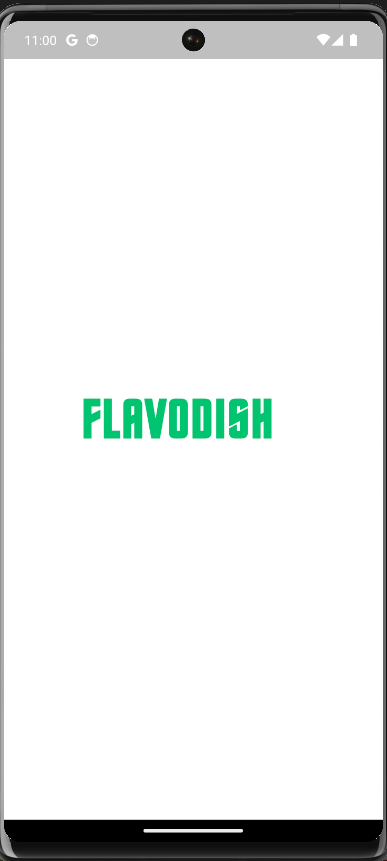
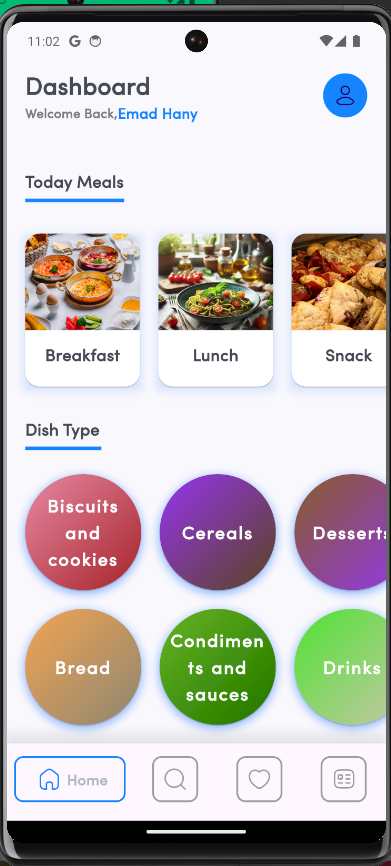
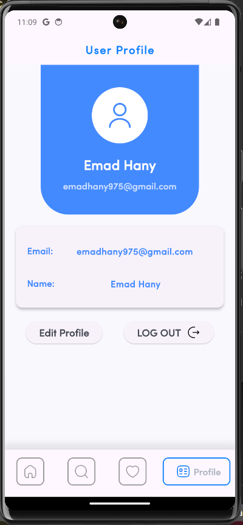
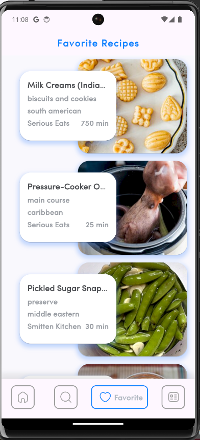
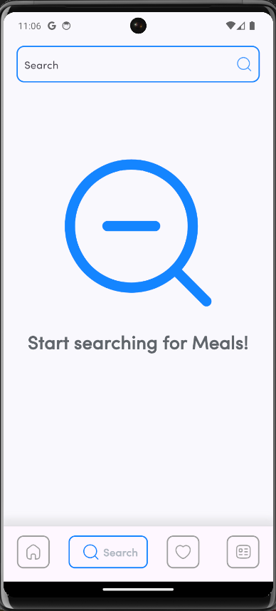
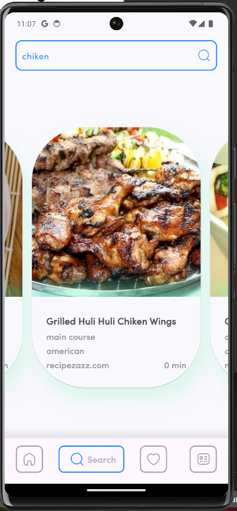
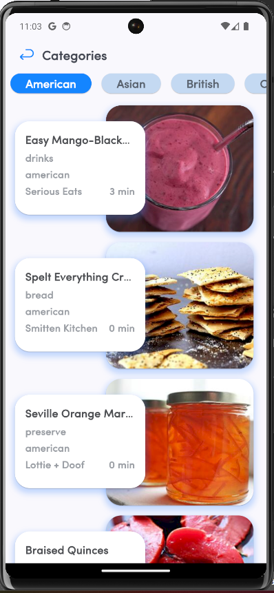
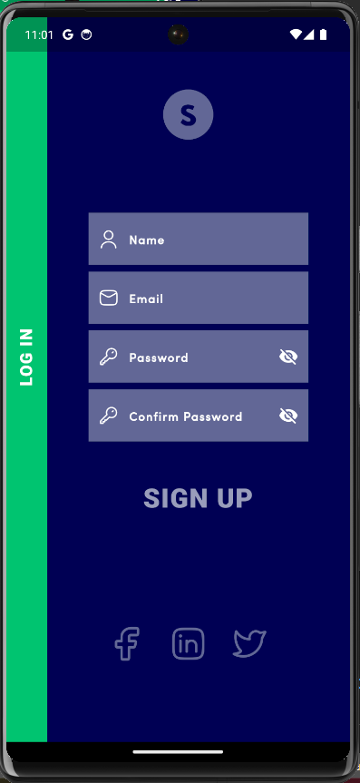
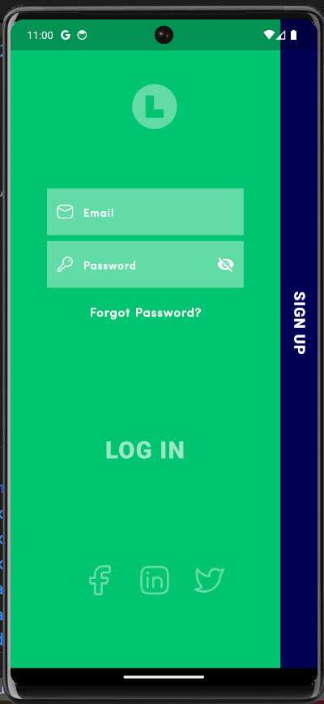
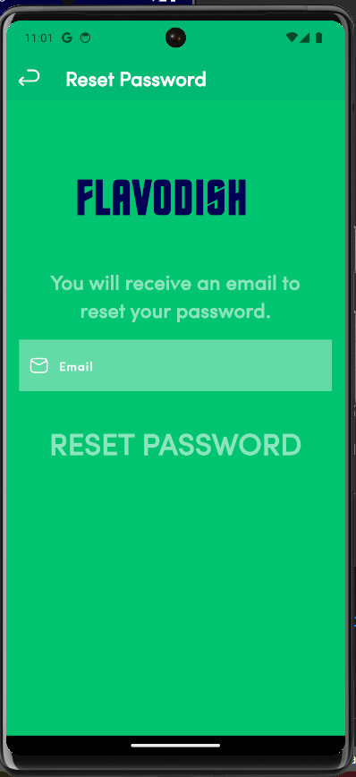
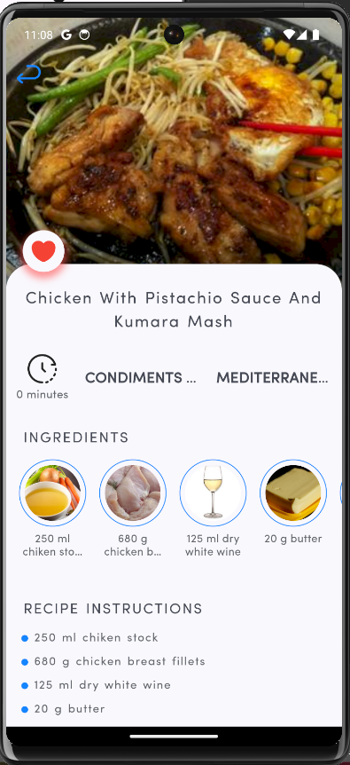
